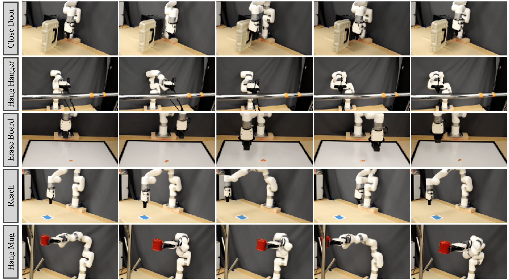

# ROT Dataset
The dataset comprises 14 trajectories with one trajectory for each task from the paper
[Watch and Match: Supercharging Imitation with Regularized Optimal Transport](https://rot-robot.github.io/).

## Creating the dataset
- The data can be downloaded from link to the dataset given on the paper website. The dataset can also be downloaded from
this [link](https://osf.io/zgh2f?view_only=e29b9dc9ea474d038d533c2245754f0c).
- Change the path in line 5 of `rot/create_rot_dataset.py` to the format `/path/to/dir/expert_demos/robotgym`.
- Run the following commands to convert the dataset to the appropriate format:
```
cd rot
python3 create_rot_dataset.py
```
- Follow the instructions provided in the main README to convert the dataset to the appropriate RLDS format.

## Dataset description
The dataset comprises observations in the form of images of size 84x84x3 and states which are continuous and have 7 dimensions. 
The action space is continuous and has 7 dimensions. The dataset also comprises rewards for each step in the trajectory. A detailed
description of the dataset can be found in `rot/rot_dataset_builder.py`. For more details about how the data was collected,
please refer to the paper.

## Visualization of the data
Rollouts for 5 of 14 tasks included in the dataset are shown below.




<!-- TODO(example_dataset): Markdown description of your dataset.
Description is **formatted** as markdown.

It should also contain any processing which has been applied (if any),
(e.g. corrupted example skipped, images cropped,...): -->
